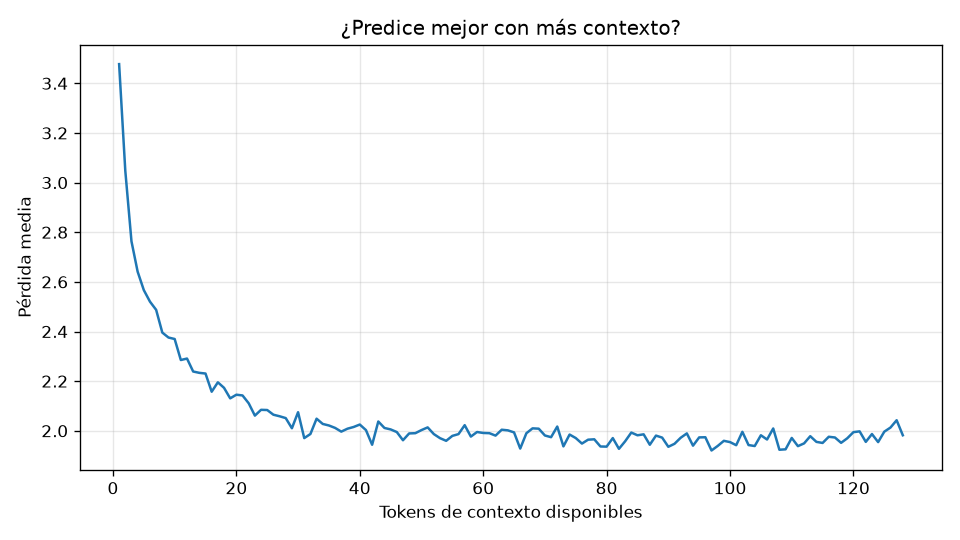

# Evaluación: mini-llm-cpu

- Checkpoint: `E:\AI\mini_llm\artifacts\checkpoints\mini-llm-cpu\best.pt` (iteración 3000)
- Parámetros: 4,229,376
- Tokens evaluados: 892,672 (conjunto de validación completo)
- Fecha: 2026-09-27 11:15

## Métricas

| Modelo | Pérdida | Perplejidad |
|---|---|---|
| Uniforme (azar) | 8.318 | 4,096 |
| Unigrama (frecuencias) | 5.810 | 333.6 |
| Bigrama (token anterior) | 3.294 | 27.0 |
| **mini-GPT** | **2.057** | **7.8** |

- Precisión top-1: **50.4 %** del siguiente token acertado
- Precisión top-5: **79.2 %** con el correcto entre los 5 primeros
- Pérdida con 1 token de contexto: 3.477; con 128: 1.982
- Diversidad de las muestras (distinct-2): 0.76

## Muestras (temperatura 0.8, top-k 50)

**Había una vez**

> Había una vez, un niño pequeño llamado Leo. Leo tenía un perro llamado Spot. Spot era un perro lindo, pero tambien tenía muchos amigos. Leo tenía un perro llamado Sam.  "¡Vamos a jugar!", dijo Leo. Tom y Tom jugaron con Max, y Tom fueron a la casa.  Despues de jugar, Leo y Tom vieron un perro grande y peludo. El perro era grande y peludo. El perro grande era grande y peludo.  "Hola, perro," dijo Leo. "¡Te voy a jugar!"  El perro grande corrió hacia el perro pequeño. Leo fue corriendo a casa

**Un día, un niño llamado Tomás**

> Un día, un niño llamado Tomásame un libro. ¡Es muy bonito! Tom quiere tener un libro. ¡Pero el libro está cerrada!  Tom vio a un niño que no estaba en el libro. El niño no tenía dinero. Tom gritó: "Oh, no!" Tom dijo: "Es un juguete especial". El niño grande estaba triste.  Tom se sentó en el libro. El niño pequeño se puso triste. Tom vio al niño pequeño que no estaba triste. Tom le dijo a Tom: "Vamos a comprar otro libro". Tom estaba feliz. ¡El niño tenía un libro!  Tom estaba feliz

**La niña tenía un gato que**

> La niña tenía un gato que se llamaba Coco. Coco era un perro muy divertido.  Más tarde, Coco se sentó en la cama. Coco se sentía triste. Coco se sentó en la cama.  Coco se sentó en la cama. Coco se puso su cama. La luz era roja. Coco se despertó. Coco quería jugar con su mamá.  Coco cerró la cama. ¡Él quería jugar! Coco se fue a dormir. Coco soñó con luz suave. ¡Y una luz amarilla! Coco se despertó.  Coco soñó. La luz era grande y brillante. Coco vio algo extraño. ¡Era un

**En el bosque vivía un oso**

> En el bosque vivía un oso de peluche. El oso era muy marrón y tenía ojos grandes. El oso quería jugar con el oso.  El oso empujó el oso. El oso empujó el árbol. ¡El oso mordió al oso! El oso estaba triste. El oso se fue.  El oso estaba triste. Entonces, el oso vio una niña. La niña tenía una torta. El oso quería la torta.  El oso caminó y caminó. El oso vio que la niña tenía una torta. La torta era deliciosa. El oso la comió.  El oso estaba feliz. La niña quería la torta.

**Mamá dijo:**

> Mamá dijo: "No puedo alcanzar las fresas". Su mamá lo pegó. Ella trajo una manzana roja. "¡Las manzanas están muy lejos!", dijo su mamá.  Ben estaba muy triste. Pero se sentía bien. No podía alcanzar las frutas. No podía alcanzarla. Estaba muy triste. Él no quería más manzanas.  Entonces, mamá estaba buscando. "¡Puedes subir al árbol!", dijo. Ben se subió al árbol. ¡El árbol se fue! "¡Gracias!", dijo.  "¡Gracias!", dijo mamá. Ben y su mamá jugaron juntos. ¡Fue muy divertido!
